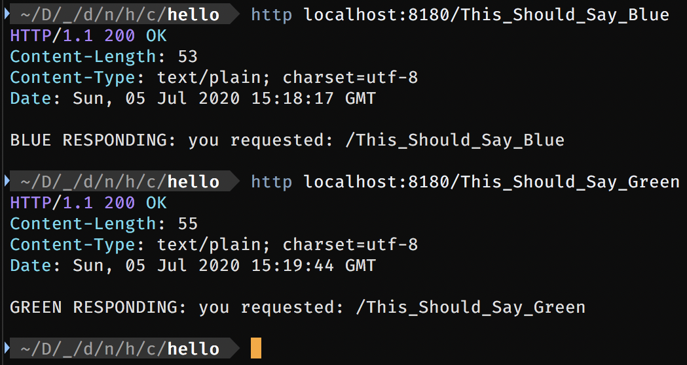
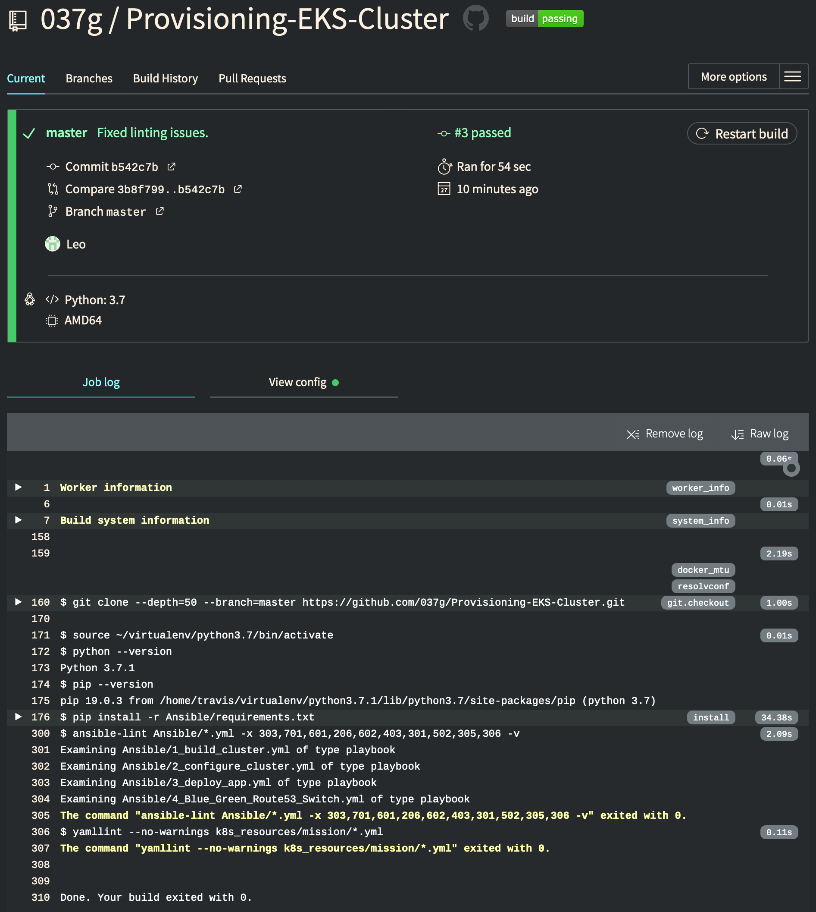

# Project Summary
This repo contains code and documentation, detailing the design and development of two independent and multi-regional AWS EKS clusters that operate with BLUE/GREEN functionality.

## OBJECTIVES
### //Provisioning
- [x] Using Terraform and/or Ansible, deploy two Kubernetes clusters across two separate public cloud regions.
    - [x] Ansible Playbooks utilizing Eksctl (with cloudformation backend).
- [x] Use Global Load Balancing to route traffic between the two clusters.
    - [x] Rout53 zone: arctiq-mission.com pointing to BLUE/GREEN's AWS ALB. Support for weighted DNS records exists but is commented out.
- [x] Configure the ability to direct users to specific application instances 
    - [x] Accomplished with External-DNS creating blue/green.arctiq-mission.com A records.
### //Deployment
- [x] Deploy a simple Kubernetes based application across both clusters
- [-] Automate the deployment of the application using any modern CI / CD tooling
of your choice
    - [x] CI with TravisCI, performing Ansible and Yaml Linting at each push.
    - [ ] CD - ToDo: Utilize [flux](https://fluxcd.io) & [kustomize](https://kustomize.io/)
- [x] Perform blue/green routing to the application across both clusters
    - [x] Accomplished through Ansible Playbook 4_Blue_Green_Route53_Switch.yml and setting the --external-variable of "env=blue/green".
- [ ] BONUS - Automate the traffic routing through a GitOps approach
    - [ ] Blocked by CD above. TODO Item.

## WALK THROUGH
Each EKS cluster will be created independently by running the playbook with `-e "env=blue/green"` from the **Ansible** directory. 

#### Ansible Deployment Scripts Overview
The Ansible Scripts should be run in the following order:

| Run Order  |  Description |
|-|-|
|  [1_Build_Cluster.yml](/Ansible/1_build_cluster.yml) | Provisions the cluster with [eksctl v0.22.0](https://eksctl.io/).  |
|  [2_Configure_Cluster.yml](/Ansible/2_configure_cluster.yml) | Configures [ALB Ingress Controller v1.16](https://kubernetes-sigs.github.io/aws-alb-ingress-controller/) |
|  [3_Deploy_App.yml](/Ansible/3_deploy_app.yml) |  Configures [External-DNS v0.7.2](https://github.com/kubernetes-sigs/external-dns) and Deploys Application >Ingress, Svc, Deployment | 
|  [4_Blue_Green_Route53_Switch.yml](/Ansible/4_Blue_Green_Route53_Switch.yml) |  Configures External DNS and Deploys Application (Ingress, Svc, Deployment) | 

#### Requirements
The project was developed/tested with the following versions. Please ensure they are installed and configured (awscli).
- [python v3.7](https://www.python.org/downloads/)
- [pipenv](https://pypi.org/project/pipenv/)
- [awscli v2.0.25](https://docs.aws.amazon.com/cli/latest/userguide/cli-chap-install.html)
- [ansible v2.9.10](https://docs.ansible.com/ansible/latest/installation_guide/intro_installation.html)
- [eksctl v0.22.0](https://eksctl.io/)

#### Simple Application
The Application we are using in this demo is a simple Go HTTP app.
It replies back on any /path.

```GO
package main
import (
    "fmt"
    "log"
    "net/http"
)

//HelloServer responds to requests with the given URL path.
func HelloServer(w http.ResponseWriter, r *http.Request){
    fmt.Fprintf(w, "GREEN RESPONDING: you requested: %s", r.URL.Path)
    log.Printf("Received request for path: %s", r.URL.Path)
}

func main(){
    var addr string = ":8180"
    handler := http.HandlerFunc(HelloServer)
    if err := http.ListenAndServe(addr, handler); err != nil {
        log.Fatalf("Could not listen on port %s %v", addr, err)
    }
}
```
It is available on [DockerHub](https://hub.docker.com/repository/docker/leogh/mission) in two flavors:

    > leogh/mission:blue

    > leogh/mission:green



#### Continuous Integration (CI)
 

[TravisCI](https://travis-ci.org/) pulls after each push, reads the contents of [.travis.yml](.travis.yml) and performs instructions. 
```yml
language: python
python:
- "3.7"

# command to install dependencies
install:
- pip install -r Ansible/requirements.txt
# command to run tests
script:
- ansible-lint Ansible/*.yml -x 303,701,601,206,602,403,301,502,305,306 -v
- yamllint --no-warnings k8s_resources/mission/*.yml
```
*Pictured above and below,  we are linting the Ansible and K8 yaml files.*



#### 1. Cluster Provisioning
Creating the EKS Cluster.

 1. Review/Set Cluster provisioning settings in the files at vars/[blue.yml](/Ansible/vars/blue.yml) & [green.yml](/Ansible/vars/green.yml).
 2. Activate the python virtual environment with pipenv.
    - >`pipenv shell`
    - >`pipenv install --requirements requirements.txt`
 3. In the Inventory file, set the ansible_python_interpreter variable to point to your Python distribution in the Virtual Environment Path:
    - ie. `ansible_python_interpreter=/Users/admin/.local/share/virtualenvs/Ansible-C3axT3Gm/bin/python3.7m`
 4. Deploy the cluster sequentially, allowing each playbook to complete before starting the next one.
    - *The playbooks will use Eksctl's Cloudformation stack to deploy an EKS cluster with 1 NodeGroup containing 2 nodes. *Note the location of the ssh key in the vars/*.yml. Set this key to your key or generate a new one to allow SSH access to the nodes for debugging purposes. If you do not set this key, you will not be able to set it later and will not have access to the EC2 nodes through SSH.*
  5. Run the Playbook: [1_Build_Cluster.yml](/Ansible/1_build_cluster.yml) 
    - > `ansible-playbook 1_Build_Cluster.yml -e "env=blue"`
    - > `ansible-playbook 1_Build_Cluster.yml -e "env=green"`

#### 2. Cluster Configuration
Configuring and adding AWS-ALB-INGRESS support. *The playbook will infer the right kubeconfig context based on the color.*

 1. Run the Playbook: [2_Configure_Cluster.yml](/Ansible/2_configure_cluster.yml)
    - > `ansible-playbook 2_Configure_Cluster.yml -e "env=blue"`
    - > `ansible-playbook 2_Configure_Cluster.yml -e "env=green"`

kubectl logs -f -n kube-system (kubectl get po -n kube-system | egrep -o 'alb-ingress[a-zA-Z0-9-]+')

#### 3. Deployment
Deploying the application using Ansible. This is a non-Git-Ops approach but will serve as a proof of concept that the cluster is working properly. *The playbook will infer the right kubeconfig context based on the color.*

 1. Run the Playbook: [3_Deploy_App.yml](/Ansible/3_deploy_app.yml)
    - > `ansible-playbook 3_Deploy_App.yml -e "env=blue"`
    - > `ansible-playbook 3_Deploy_App.yml -e "env=green"`

##### External-DNS
 - A copy of External-DNS will be deployed into the application's namespace.
 - External-DNS will monitor for ingress controllers and upsert A records in Route53.
 
*Demo of Step 3 with ExternalDNS Record Change*

#### 4. Switch to Blue/Green
Once both clusters are up and have gone through playbooks 1-3, you can
change the image tag in the application to a different version.

You will have access to each copy directly through:
> blue.arctiq-mission.com

> green.arctiq-mission.com

*In the examples above, we have registered a domain with Route53.*

To change the apex of the domain arctiq-mission.com to point to either Blue or Green deployments:

1. Run the Playbook: [4_Blue_Green_Route53_Switch.yml](/Ansible/4_Blue_Green_Route53_Switch.yml) with the color you wish the apex to become active with.
    - > `ansible-playbook 4_Blue_Green_Route53_Switch.yml -e "env=blue"` # Switches root domain to BLUE
       - *This process will also upsert a TXT record indicating the deployment color and date of switch. This can inform other monitoring, reporting, and CI/CD processes.*

> arctiq-mission.com.  TXT  "BLUE/GREEN Switched to *!* green *!* at 2020-07-04-22-36-53"
    
*Demo of Step 4 BLUE/GREEN Switch*.

## Git-Ops Approach (todo)
To operate in a Git-Ops approach, from a **single** repository serving two separate clusters, we will have to split the **K8s_resources/mission** folder structure into two subfolders, one for each deployment.

        .
        ├── iam_policies
        │  ├── alb_iam_policy.json
        │  └── external-dns-policy.json
        ├── kube-system
        │  ├── alb-ingress-controller.yaml
        │  └── rbac-role.yaml
        └── mission
            ├── Blue
            │  ├── 1_mission-namespace.yml
            │  ├── 2_mission-deployment.yml
            │  ├── 3_mission-service.yml
            │  ├── 4_mission-ingress-controller.yml
            │  └── 5_mission-external-dns.yml
            └── Green
                ├── 1_mission-namespace.yml
                ├── 2_mission-deployment.yml
                ├── 3_mission-service.yml
                ├── 4_mission-ingress-controller.yml
                └── 5_mission-external-dns.yml

To acocmplish this, we will need to use [flux](https://fluxcd.io) & [kustomize](https://kustomize.io/).

 

*Flux monitors all of the container image repositories that you specify. It detects new images, triggers deployments, and automatically updates the desired running configuration of your Kubernetes cluster—and does so within the bounds of a configurable deployment policy.* Source([flux](https://fluxcd.io))

#### High Level Action Plan:
- External-DNS will handle record creation.
- Flux will ensure the latest image:tag and K8 Objects are running. On each cluster, Flux will be partitioned to either path (Blue/Green) `--git-path` to constrain where Flux starts looking.
- kustomize will handle overlay and patch syntax.

    TODO..
